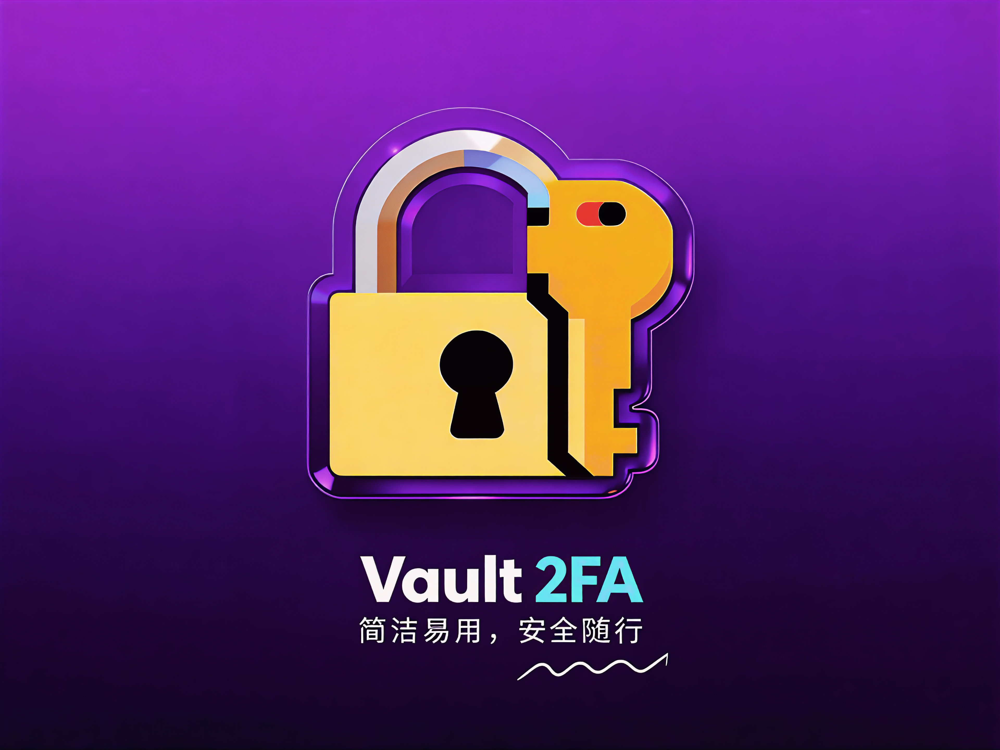
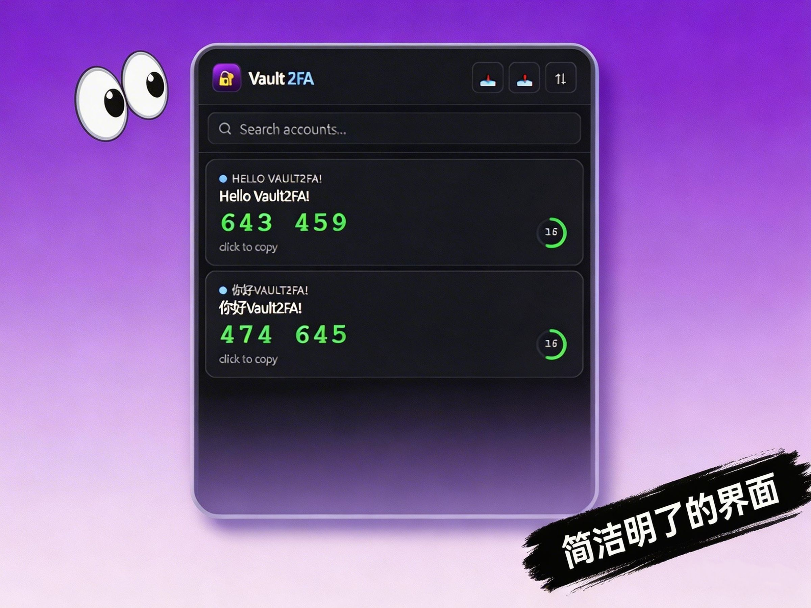
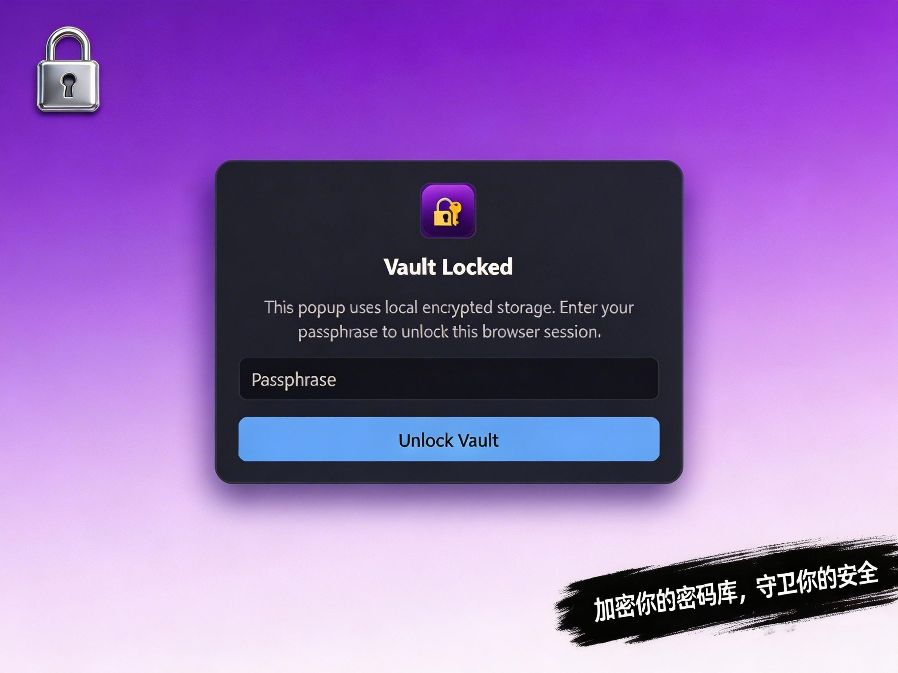
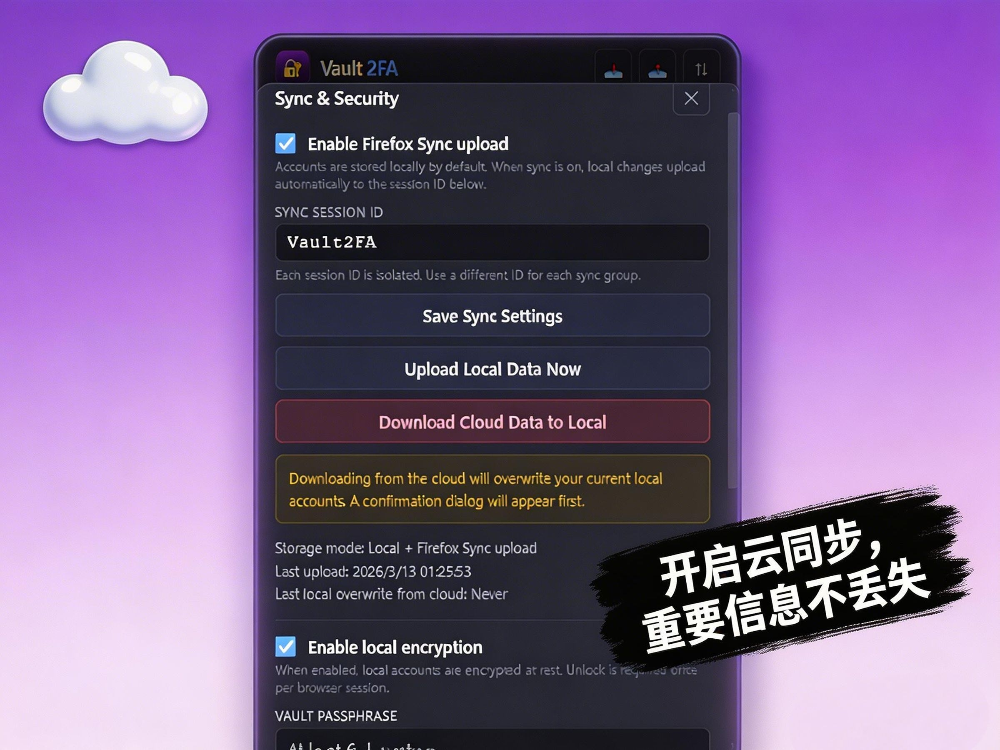
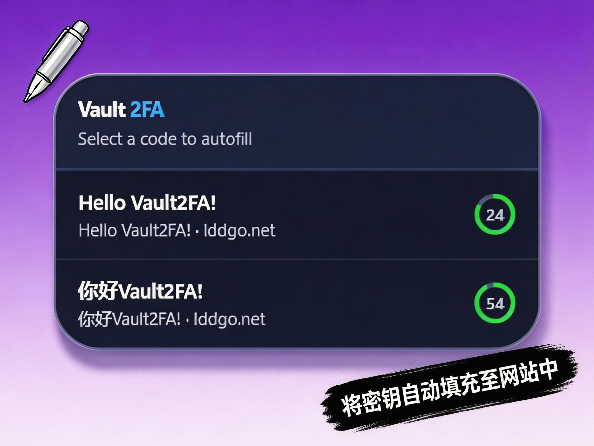

<!-- SPDX-License-Identifier: MIT -->
 

    
  <h2 align="center" style="font-weight: 800">Vault2FA</h2>

  

    一个为Firefox开发的、简洁安全的TOTP/HOTP认证器插件
     
    A secure and simple TOTP/HOTP authenticator add-on for Firefox.

### 功能特性 / Features

- 手动添加验证码账户（TOTP/HOTP）  
  Add accounts manually (TOTP/HOTP)
- 扫描二维码添加账户（`otpauth://`）  
  Add accounts by scanning QR codes (`otpauth://`)
- 本地存储可开启加密（口令解锁）  
  Optional encrypted local storage (passphrase unlock)
- 支持通过 Firefox Sync 按会话 ID 上传备份到云端  
  Upload backups to the cloud via Firefox Sync with a session ID
- 可手动从云端下载并覆盖本地数据（有确认提示）  
  Manually download cloud data and overwrite local data (with confirmation)
- 支持通过 `otpauth://` URI或json文件形式导入/导出账号数据  
  Import/export account data via `otpauth://` URIs or json files
- 支持根据自定义的网址匹配规则识别验证码输入框并自动填充  
  Recognizes and automatically fills in 2fa input fields based on custom URL matching rules.

### 安装与使用 / Install & Use

#### 从AMO安装（发行版） / Install from AMO (release)

#### 从仓库安装（开发版） / Install from repository (development)
1. 打开 Firefox，访问 `about:debugging#/runtime/this-firefox`  
   Open Firefox and go to `about:debugging#/runtime/this-firefox`
2. 点击 **Load Temporary Add-on...**  
   Click **Load Temporary Add-on...**
3. 选择本仓库中的 `manifest.json`  
   Select `manifest.json` from this repository

#### 快速上手 / Quick start
1. 点击插件图标，选择 **Add Account**  
   Click the add-on icon and choose **Add Account**
2. 通过 **Manual** 或 **Scan QR** 添加账户  
   Add an account via **Manual** or **Scan QR**
3. 在 **Sync & Security** 中可启用：  
   In **Sync & Security**, you can enable:
   - Firefox Sync 上传 / Firefox Sync upload
   - 本地加密与锁定 / Local encryption and vault lock

### 安全提示 / Security Notes

- 请妥善保管导出的 URI、同步会话 ID 和加密口令。  
  Keep exported URIs, sync session IDs, and vault passphrases secure.
- 丢失口令可能导致无法解密本地数据。  
  Losing your passphrase may make local data unrecoverable.
- 强烈建议在本地保存一份密码库的备份，因为Firefox Sync并非为同步秘钥设计，云同步可能存在潜在问题。  
  It is strongly recommended to keep a local backup of your vault since Firefox Sync is not designed for syncing secrets. Cloud sync
  therefore may have potential bugs.

### 截图 / Screenshots

### 项目结构 / Project Structure

- `manifest.json`: 扩展配置 / Extension manifest
- `popup/popup.html`, `popup/popup.js`, `popup/popup.css`: 主弹窗界面与逻辑 / Main popup UI and logic
- `qr/qr.html`, `qr/qr.js`, `qr/qr.css`: 二维码扫描页面 / QR scanning page
- `background.js`: 后台逻辑 / Background logic
- `autofill/autofill-content.js`, `autofill/autofill.css`: 自动填充弹窗 / Autofill pop-up
- `json-import/json-import.js`, `json-import/json-import.html`: 通过JSON文件导入账号页面 / Import account via json file page

### 致谢 / Acknowledgements

本项目使用了以下开源仓库的代码  
This repository uses code from the following open-source repositories.

- [hectorm/otpauth](https://github.com/hectorm/otpauth)
- [nimiq/qr-scanner](https://github.com/nimiq/qr-scanner)
